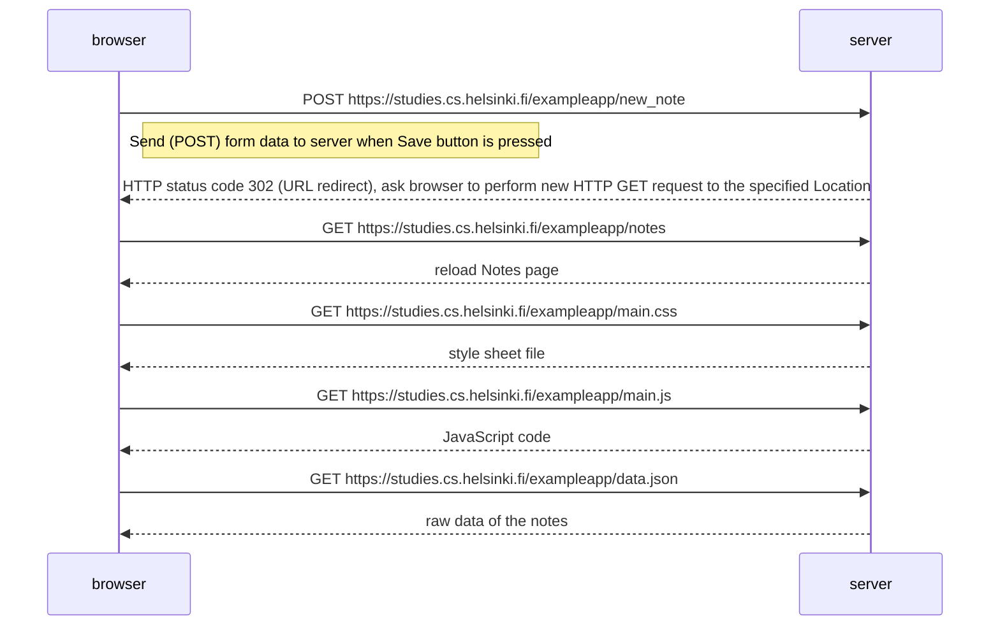
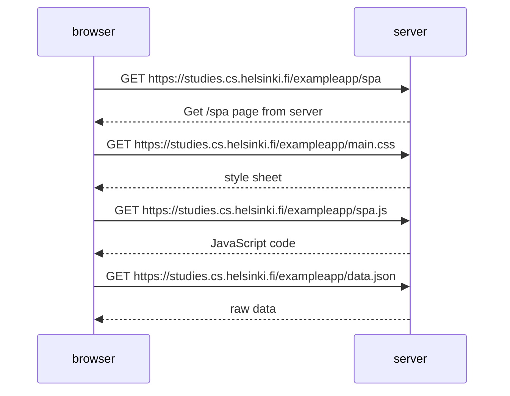
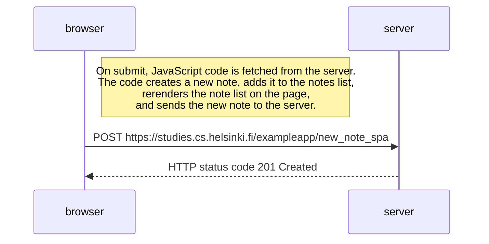

0.4: New note diagram

```mermaid
sequenceDiagram
    participant browser
    participant server
    browser->>server: POST https://studies.cs.helsinki.fi/exampleapp/new_note
    Note right of browser: Send (POST) form data to server when Save button is pressed
    server-->>browser: HTTP status code 302 (URL redirect), ask browser to perform new HTTP GET request to the specified Location
    browser->>server: GET https://studies.cs.helsinki.fi/exampleapp/notes
    server-->>browser: reload Notes page
    browser->>server: GET https://studies.cs.helsinki.fi/exampleapp/main.css
    server-->>browser: style sheet file
    browser->>server: GET https://studies.cs.helsinki.fi/exampleapp/main.js
    server-->>browser: JavaScript code
    browser->>server: GET https://studies.cs.helsinki.fi/exampleapp/data.json
    server-->>browser: raw data of the notes
```

0.5: Single page app diagram

```mermaid
sequenceDiagram
    participant browser
    participant server
    browser->>server: GET https://studies.cs.helsinki.fi/exampleapp/spa
    server-->>browser: Get /spa page from server
    browser->>server: GET https://studies.cs.helsinki.fi/exampleapp/main.css
    server-->>browser: style sheet
    browser->>server: GET https://studies.cs.helsinki.fi/exampleapp/spa.js
    server-->>browser: JavaScript code
    browser->>server: GET https://studies.cs.helsinki.fi/exampleapp/data.json
    server-->>browser: raw data
```

0.6: New note in Single page app diagram

```mermaid
sequenceDiagram
    participant browser
    participant server
    Note right of browser: On submit, JavaScript code is fetched from the server. <br/>The code creates a new note, adds it to the notes list,<br/> rerenders the note list on the page, <br/>and sends the new note to the server.
    browser->>server: POST https://studies.cs.helsinki.fi/exampleapp/new_note_spa
    server-->>browser: HTTP status code 201 Created
```
